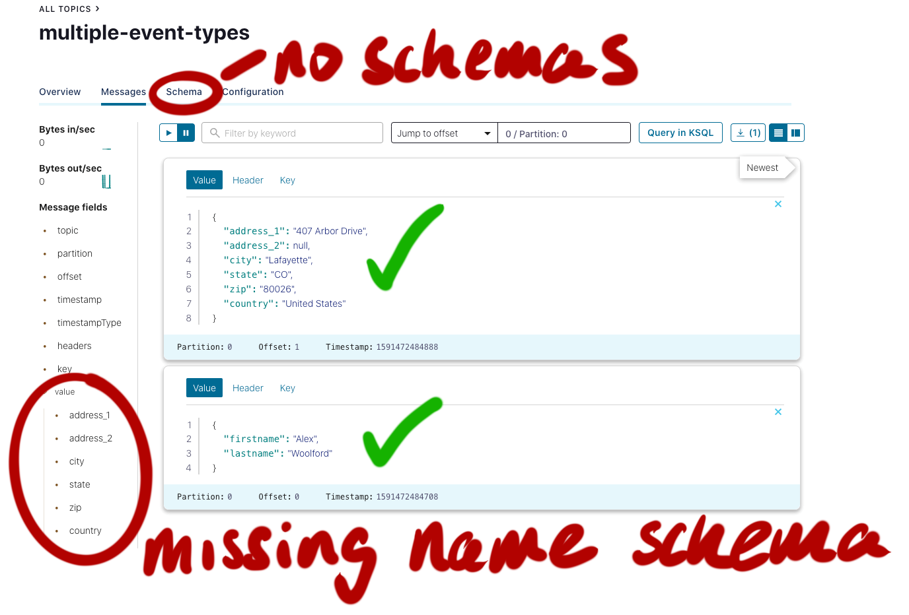

# multiple event types demo

The purpose of this demo is to show how multiple event types can be stored in the same Avro serialized topic. The first step is to create Java classes from the Avro schemas:

    mvn generate-sources

There are two different record schemas:

1. name record (firstname, lastname)
2. address record (address, city, state, zip, country)

The producer uses the `TopicRecordNameStrategy`, which allows us to store different record types in the same topic.

The Avro consumer will deserialize the messages using the appropriate schema for each message:

    # kafka-avro-console-consumer --bootstrap-server cp01.woolford.io:9092 --topic multiple-event-types --property schema.registry.url="http://cp01.woolford.io:8081" --from-beginning
    {"firstname":"Alex","lastname":"Woolford"}
    {"address_1":"407 Arbor Drive","address_2":null,"city":"Lafayette","state":"CO","zip":"80026","country":"United States"}

In order to have multiple message types in a topic, you'll want to set the schema compatibility mode to `None`.

At the time of writing (2020-06-06), the deserialized messages are displayed correctly in the Confluent Control Center, but the schemas themselves aren't displayed.

## JSON vs. Avro

In addition to all the schema management fu, Avro uses less network bandwidth and storage:

    [main] INFO io.woolford.AvroJsonSizeComparison - {"firstname": "Alex", "lastname": "Woolford"}
    [main] INFO io.woolford.AvroJsonSizeComparison - Avro bytes: 24
    [main] INFO io.woolford.AvroJsonSizeComparison - JSON bytes: 45
 
For this simple record, Avro was about half the number of bytes as its JSON equivalent. That translates to very significant cost-savings at scale.
